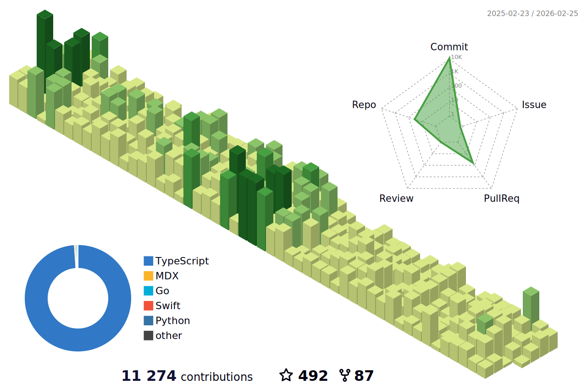

### Hi there 👋



 

[](https://github.com/anuraghazra/github-readme-stats)


 

<!--START_SECTION:waka-->


**🐱 My GitHub Data** 

> 📦 1.1 MB Used in GitHub's Storage 
 > 
> 🏆 270 Contributions in the Year 2024
 > 
> 🚫 Not Opted to Hire
 > 
> 📜 53 Public Repositories 
 > 
> 🔑 11 Private Repositories 
 > 
**I'm a Night 🦉** 

```text
🌞 Morning                6 commits           ░░░░░░░░░░░░░░░░░░░░░░░░░   01.63 % 
🌆 Daytime                32 commits          ██░░░░░░░░░░░░░░░░░░░░░░░   08.67 % 
🌃 Evening                60 commits          ████░░░░░░░░░░░░░░░░░░░░░   16.26 % 
🌙 Night                  271 commits         ██████████████████░░░░░░░   73.44 % 
```
📅 **I'm Most Productive on Friday** 

```text
Monday                   46 commits          ███░░░░░░░░░░░░░░░░░░░░░░   12.47 % 
Tuesday                  32 commits          ██░░░░░░░░░░░░░░░░░░░░░░░   08.67 % 
Wednesday                46 commits          ███░░░░░░░░░░░░░░░░░░░░░░   12.47 % 
Thursday                 65 commits          ████░░░░░░░░░░░░░░░░░░░░░   17.62 % 
Friday                   66 commits          ████░░░░░░░░░░░░░░░░░░░░░   17.89 % 
Saturday                 61 commits          ████░░░░░░░░░░░░░░░░░░░░░   16.53 % 
Sunday                   53 commits          ████░░░░░░░░░░░░░░░░░░░░░   14.36 % 
```


📊 **This Week I Spent My Time On** 

```text
🕑︎ Time Zone: Asia/Shanghai

💬 Programming Languages: 
TypeScript               4 hrs 49 mins       ████████████████░░░░░░░░░   64.65 % 
Bash                     1 hr 13 mins        ████░░░░░░░░░░░░░░░░░░░░░   16.50 % 
Other                    53 mins             ███░░░░░░░░░░░░░░░░░░░░░░   11.86 % 
JSON                     26 mins             █░░░░░░░░░░░░░░░░░░░░░░░░   05.85 % 
Prisma                   5 mins              ░░░░░░░░░░░░░░░░░░░░░░░░░   01.14 % 

🔥 Editors: 
VS Code                  7 hrs 27 mins       █████████████████████████   100.00 % 

💻 Operating System: 
Mac                      7 hrs 27 mins       █████████████████████████   100.00 % 
```


 Last Updated on 28/04/2024 01:00:07 UTC
<!--END_SECTION:waka-->
