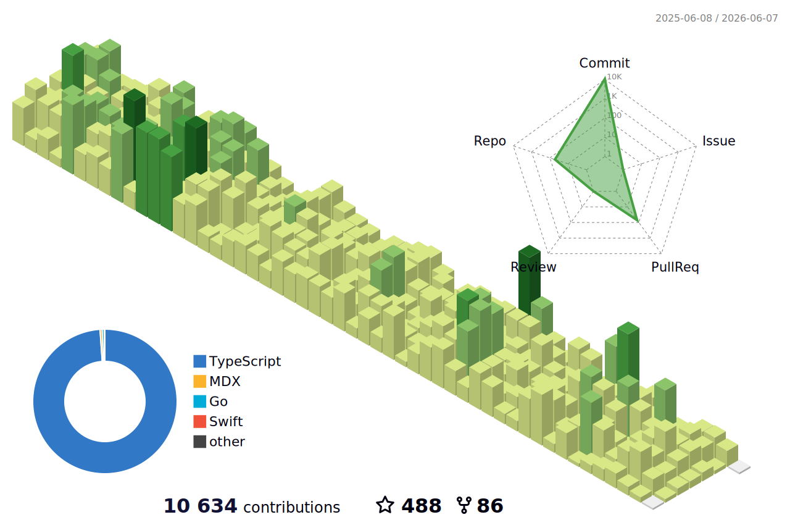

### Hi there 👋



 

[](https://github.com/anuraghazra/github-readme-stats)


 

<!--START_SECTION:waka-->


**🐱 My GitHub Data** 

> 📦 1.5 MB Used in GitHub's Storage 
 > 
> 🏆 1,031 Contributions in the Year 2026
 > 
> 🚫 Not Opted to Hire
 > 
> 📜 69 Public Repositories 
 > 
> 🔑 54 Private Repositories 
 > 
**I'm a Night 🦉** 

```text
🌞 Morning                1567 commits        ██░░░░░░░░░░░░░░░░░░░░░░░   08.40 % 
🌆 Daytime                7327 commits        ██████████░░░░░░░░░░░░░░░   39.28 % 
🌃 Evening                5860 commits        ████████░░░░░░░░░░░░░░░░░   31.42 % 
🌙 Night                  3899 commits        █████░░░░░░░░░░░░░░░░░░░░   20.90 % 
```
📅 **I'm Most Productive on Thursday** 

```text
Monday                   2450 commits        ███░░░░░░░░░░░░░░░░░░░░░░   13.13 % 
Tuesday                  2780 commits        ████░░░░░░░░░░░░░░░░░░░░░   14.90 % 
Wednesday                2905 commits        ████░░░░░░░░░░░░░░░░░░░░░   15.57 % 
Thursday                 3423 commits        █████░░░░░░░░░░░░░░░░░░░░   18.35 % 
Friday                   2621 commits        ████░░░░░░░░░░░░░░░░░░░░░   14.05 % 
Saturday                 2399 commits        ███░░░░░░░░░░░░░░░░░░░░░░   12.86 % 
Sunday                   2075 commits        ███░░░░░░░░░░░░░░░░░░░░░░   11.12 % 
```


📊 **This Week I Spent My Time On** 

```text
🕑︎ Time Zone: Asia/Shanghai

💬 Programming Languages: 
No Activity Tracked This Week

🔥 Editors: 
No Activity Tracked This Week

💻 Operating System: 
No Activity Tracked This Week
```


 Last Updated on 03/03/2026 00:32:57 UTC
<!--END_SECTION:waka-->
