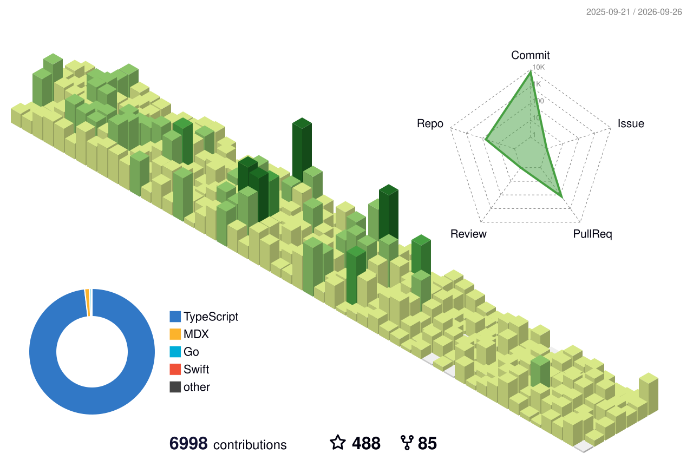

### Hi there 👋



 

[](https://github.com/anuraghazra/github-readme-stats)


 

<!--START_SECTION:waka-->


**🐱 My GitHub Data** 

> 📦 2.3 MB Used in GitHub's Storage 
 > 
> 🏆 4,040 Contributions in the Year 2026
 > 
> 🚫 Not Opted to Hire
 > 
> 📜 75 Public Repositories 
 > 
> 🔑 82 Private Repositories 
 > 
**I'm an Early 🐤** 

```text
🌞 Morning                2519 commits        ██░░░░░░░░░░░░░░░░░░░░░░░   07.70 % 
🌆 Daytime                14069 commits       ███████████░░░░░░░░░░░░░░   42.98 % 
🌃 Evening                9867 commits        ████████░░░░░░░░░░░░░░░░░   30.14 % 
🌙 Night                  6277 commits        █████░░░░░░░░░░░░░░░░░░░░   19.18 % 
```
📅 **I'm Most Productive on Thursday** 

```text
Monday                   5204 commits        ████░░░░░░░░░░░░░░░░░░░░░   15.90 % 
Tuesday                  4759 commits        ████░░░░░░░░░░░░░░░░░░░░░   14.54 % 
Wednesday                4971 commits        ████░░░░░░░░░░░░░░░░░░░░░   15.19 % 
Thursday                 5464 commits        ████░░░░░░░░░░░░░░░░░░░░░   16.69 % 
Friday                   5174 commits        ████░░░░░░░░░░░░░░░░░░░░░   15.81 % 
Saturday                 3634 commits        ███░░░░░░░░░░░░░░░░░░░░░░   11.10 % 
Sunday                   3526 commits        ███░░░░░░░░░░░░░░░░░░░░░░   10.77 % 
```


📊 **This Week I Spent My Time On** 

```text
🕑︎ Time Zone: Asia/Shanghai

💬 Programming Languages: 
No Activity Tracked This Week

🔥 Editors: 
No Activity Tracked This Week

💻 Operating System: 
No Activity Tracked This Week
```

🤖 **AI Coding This Week** 

```text
No AI Coding Activity Tracked This Week
```


 Last Updated on 14/08/2026 01:59:38 UTC
<!--END_SECTION:waka-->
