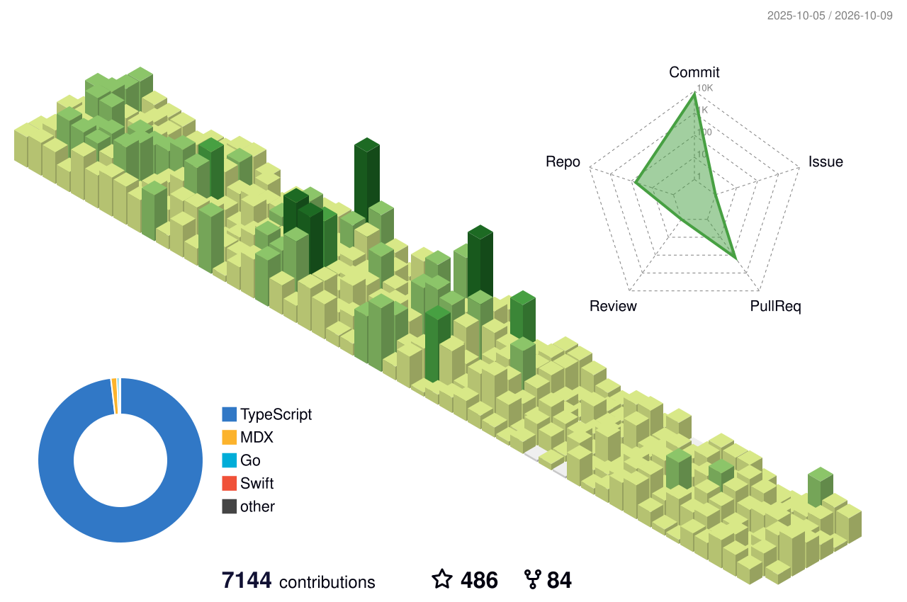

### Hi there 👋



 

[](https://github.com/anuraghazra/github-readme-stats)


 

<!--START_SECTION:waka-->


**🐱 My GitHub Data** 

> 📦 2.5 MB Used in GitHub's Storage 
 > 
> 🏆 4,792 Contributions in the Year 2026
 > 
> 🚫 Not Opted to Hire
 > 
> 📜 76 Public Repositories 
 > 
> 🔑 88 Private Repositories 
 > 
**I'm an Early 🐤** 

```text
🌞 Morning                4703 commits        ██░░░░░░░░░░░░░░░░░░░░░░░   08.49 % 
🌆 Daytime                28256 commits       █████████████░░░░░░░░░░░░   51.01 % 
🌃 Evening                15663 commits       ███████░░░░░░░░░░░░░░░░░░   28.28 % 
🌙 Night                  6767 commits        ███░░░░░░░░░░░░░░░░░░░░░░   12.22 % 
```
📅 **I'm Most Productive on Monday** 

```text
Monday                   11300 commits       █████░░░░░░░░░░░░░░░░░░░░   20.40 % 
Tuesday                  10536 commits       █████░░░░░░░░░░░░░░░░░░░░   19.02 % 
Wednesday                7683 commits        ███░░░░░░░░░░░░░░░░░░░░░░   13.87 % 
Thursday                 8440 commits        ████░░░░░░░░░░░░░░░░░░░░░   15.24 % 
Friday                   9850 commits        ████░░░░░░░░░░░░░░░░░░░░░   17.78 % 
Saturday                 3801 commits        ██░░░░░░░░░░░░░░░░░░░░░░░   06.86 % 
Sunday                   3779 commits        ██░░░░░░░░░░░░░░░░░░░░░░░   06.82 % 
```


📊 **This Week I Spent My Time On** 

```text
🕑︎ Time Zone: Asia/Shanghai

💬 Programming Languages: 
No Activity Tracked This Week

🔥 Editors: 
No Activity Tracked This Week

💻 Operating System: 
No Activity Tracked This Week
```

🤖 **AI Coding This Week** 

```text
No AI Coding Activity Tracked This Week
```


 Last Updated on 30/09/2026 04:21:42 UTC
<!--END_SECTION:waka-->
