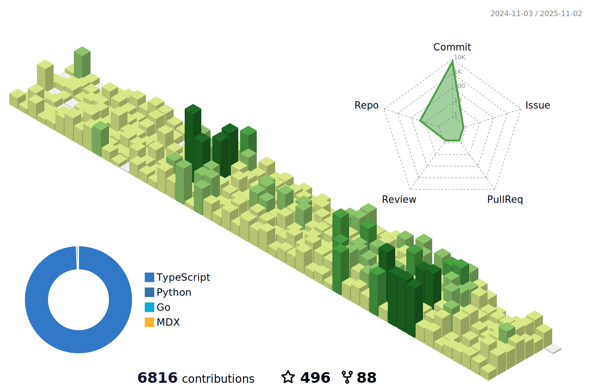

### Hi there 👋



 

[](https://github.com/anuraghazra/github-readme-stats)


 

<!--START_SECTION:waka-->


**🐱 My GitHub Data** 

> 📦 1.2 MB Used in GitHub's Storage 
 > 
> 🏆 9,037 Contributions in the Year 2025
 > 
> 🚫 Not Opted to Hire
 > 
> 📜 67 Public Repositories 
 > 
> 🔑 42 Private Repositories 
 > 
**I'm a Night 🦉** 

```text
🌞 Morning                1164 commits        ██░░░░░░░░░░░░░░░░░░░░░░░   08.76 % 
🌆 Daytime                5318 commits        ██████████░░░░░░░░░░░░░░░   40.03 % 
🌃 Evening                4278 commits        ████████░░░░░░░░░░░░░░░░░   32.20 % 
🌙 Night                  2526 commits        █████░░░░░░░░░░░░░░░░░░░░   19.01 % 
```
📅 **I'm Most Productive on Thursday** 

```text
Monday                   1787 commits        ███░░░░░░░░░░░░░░░░░░░░░░   13.45 % 
Tuesday                  1945 commits        ████░░░░░░░░░░░░░░░░░░░░░   14.64 % 
Wednesday                2012 commits        ████░░░░░░░░░░░░░░░░░░░░░   15.14 % 
Thursday                 2484 commits        █████░░░░░░░░░░░░░░░░░░░░   18.70 % 
Friday                   1801 commits        ███░░░░░░░░░░░░░░░░░░░░░░   13.56 % 
Saturday                 1805 commits        ███░░░░░░░░░░░░░░░░░░░░░░   13.59 % 
Sunday                   1452 commits        ███░░░░░░░░░░░░░░░░░░░░░░   10.93 % 
```


📊 **This Week I Spent My Time On** 

```text
🕑︎ Time Zone: Asia/Shanghai

💬 Programming Languages: 
TypeScript               1 hr 33 mins        ████████████████░░░░░░░░░   65.77 % 
Git Config               20 mins             ████░░░░░░░░░░░░░░░░░░░░░   14.34 % 
Bash                     16 mins             ███░░░░░░░░░░░░░░░░░░░░░░   11.44 % 
Other                    9 mins              ██░░░░░░░░░░░░░░░░░░░░░░░   06.58 % 
JSON                     2 mins              ░░░░░░░░░░░░░░░░░░░░░░░░░   01.87 % 

🔥 Editors: 
Cursor                   2 hrs 21 mins       █████████████████████████   100.00 % 

💻 Operating System: 
Mac                      2 hrs 21 mins       █████████████████████████   100.00 % 
```


 Last Updated on 29/12/2025 00:28:37 UTC
<!--END_SECTION:waka-->
